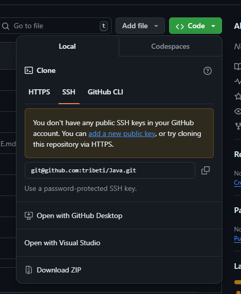

# Hướng dẫn tải về
- B1 : Clone repo này về  
  

- B2 : Tải [Java](https://javadl.oracle.com/webapps/download/AutoDL?BundleId=250111_d8aa705069af427f9b83e66b34f5e380) về
- B3 : Tải 1 Java IDE bất kì (Khuyến khích tải [IntelliJ](https://download.jetbrains.com/idea/ideaIC-2024.2.0.1.exe)) 
- B4 : Mở folder [src](src)
- B5 : Chọn file [Main.java](src/Main.java)
- B6 : Chạy :)